# Top 5 Largest Files by Size

## Pie Chart (Proportional Representation)

## Flowchart with Proportional Box Sizes

```mermaid
flowchart TD
    A["📄 nke-10k-2023.pdf<br/>2.3 MB<br/>2,397,936 bytes"]:::largest
    B["📦 package-lock.json<br/>1.0 MB<br/>1,076,485 bytes"]:::large
    C["🗄️ chroma.sqlite3<br/>164 KB<br/>167,936 bytes"]:::medium
    D["📋 logs.json<br/>44 KB<br/>44,811 bytes"]:::small
    E["📝 classes.stub.ts<br/>19 KB<br/>18,955 bytes"]:::smallest
    
    classDef largest fill:#ff6b6b,stroke:#c92a2a,stroke-width:8px,font-size:16px
    classDef large fill:#ff8787,stroke:#c92a2a,stroke-width:6px,font-size:14px
    classDef medium fill:#ffa8a8,stroke:#c92a2a,stroke-width:4px,font-size:12px
    classDef small fill:#ffc9c9,stroke:#c92a2a,stroke-width:2px,font-size:11px
    classDef smallest fill:#ffe0e0,stroke:#c92a2a,stroke-width:1px,font-size:10px
```

## File Details

1. **nke-10k-2023.pdf** - 2.3 MB (2,397,936 bytes)
   - Path: `apps/lg-cli/src/tutorials/semantic-search/data/nke-10k-2023.pdf`

2. **package-lock.json** - 1.0 MB (1,076,485 bytes)
   - Path: `package-lock.json`

3. **chroma.sqlite3** - 164 KB (167,936 bytes)
   - Path: `chroma/chroma.sqlite3`

4. **logs.json** - 44 KB (44,811 bytes)
   - Path: `apps/chat-tools/public/assets/logs.json`

5. **classes.stub.ts** - 19 KB (18,955 bytes)
   - Path: `apps/text2rest/api/src/app/classes.stub.ts`
